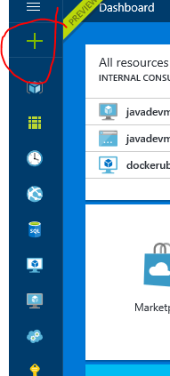
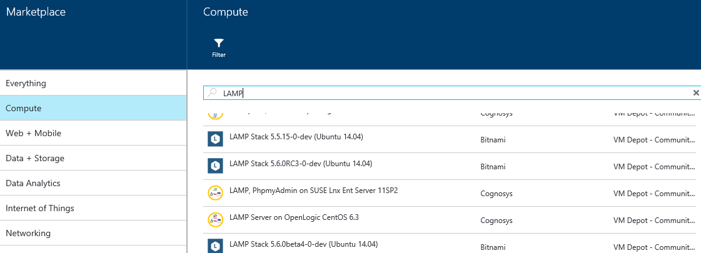
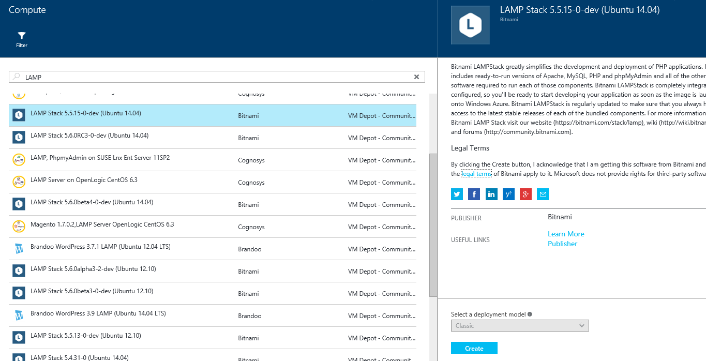
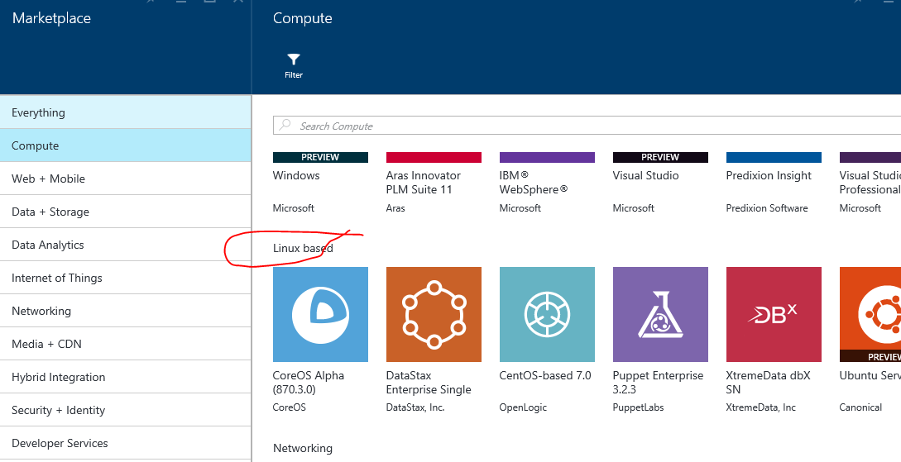
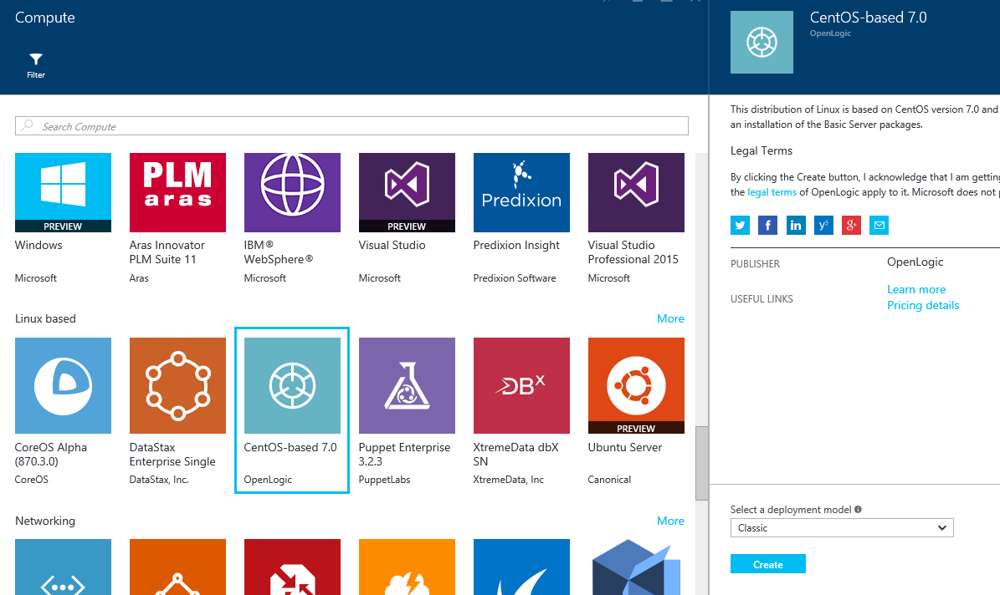
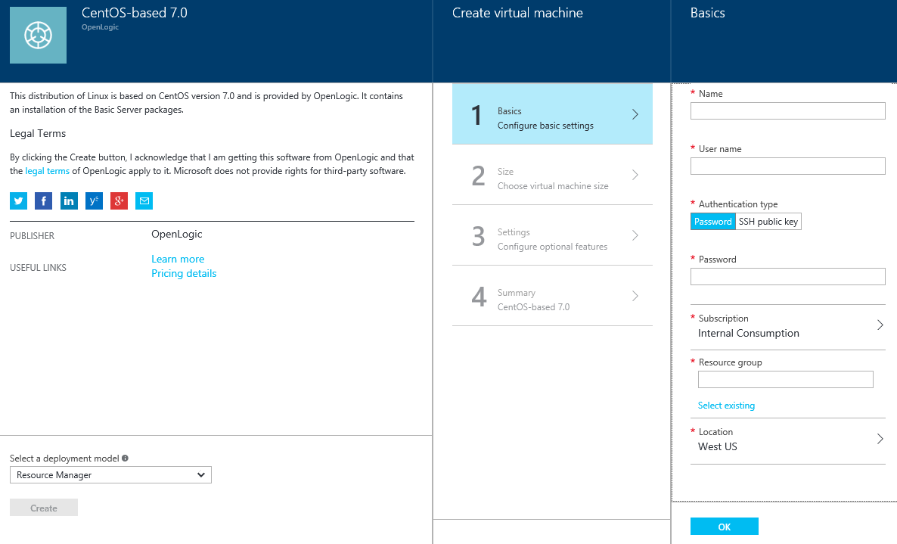
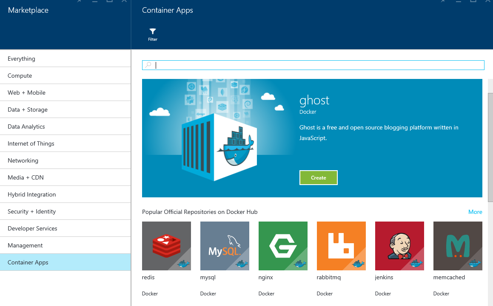

#Linux Demos
Included below are step-by-step instructions for 5 demos

##Marketplace Demo
**Demonstrate provisioning Linux VMs using Portal -> Marketplace**

  1. Go to [Azure Portal] (http://portal.azure.com) *(Explain we are going to look at the options available to provision new Linux VMs)*
  2. Click '+' 

  

  3. CLick 'Compute' *(Explain availabilily of images from partners with pre-installed software/products)*
  4. Search for 'LAMP' stack (Linux, Apache, MySQL, PHP)
 
  
  
  5. Select the LAMP image from Bitnami
  
  

  6. Explain how easy and user-friendly it is to create a VM usng the image. *(You can stop here or actually demo provisioning the VM depending upon the audience's experience with provisioning a VM from the portal)*
  7. Remove the 'Search' and go back to default 'Compute' detail page.
  8. Scroll down to 'Linux Based' VMs *(Talk about the Linux distros supported by Azure)*
   
    

  9. Select 'CentOS-based 7.0' image from OpenLogic
   
   

  10. Showcase the option to provision the VM using 'Classic' or 'Resource Manager' approach
  
   
  
  11. Explain how easy and user-friendly it is to create a VM using the image. *(You can stop here or actually demo provisioning the VM depending upon the audience's experience with provisioning a VM from the portal)*
  
  

  12. Click the 'Container Apps'. *(Explain these are shortlisted images from Docker Hub that are made available via the Azure portal. Once selected the image is provisioned using Docker Compose, which allows to provision the image, install Docker and install the container image for the selected software/product (e.g. redis, mysql etc.)*
  
  

  ##VM Depot Demo
  **Demonstrate provisioning Linux VMs made available from the 'community' at VM Depot**
  
  1. In the ‘Compute’ details pane, scroll down to the ‘VM Depot – Community Images’ section. *(Explain we are going to look at the options available from community)*
  2. Go to https://vmdepot.msopentech.com
  3. Search for 'MEAN' *(Explain how it brings forth the MEAN stack based community images to pick from. Explain about the options available to provision the VM from within the VM Depot. We’ll go deeper with the ‘Deployment Script’ )*
  4. Click 'Deployment Script'
  5. Click 'I Agree' in the popup
  6. Pick the 'Region' from the 'Select Region' drop down
  7. Script to provision VM is displayed *(Explain that we can use 'Azure CLI' to execute the script)*

##Azure CLI Demo
**Demonstrate the usage of Azure CLI for scripting Linux based VMs usage

  20.	Go to http://portal.azure.com 
  21.	Provision a VM with pre-installed Docker e.g. ‘Docker on Ubuntu Server (preview)’ from Canonical+Microsoft *(These steps are about provisioning a VM with Docker to demonstrate Azure CLI. Explain that Azure CLI has dependencies e.g. NodeJS. One easy way to experiment and use Azure CLI is via Docker Containers using the Container image from Microsoft)*
  	
  

  22.	Go to https://hub.docker.com
  23.	Search for 'microsoft' *(Explain the availability of Docker image for azure-cli from Microsoft)*
  24.	SSH into the VM provisioned above
  25.	Run command ‘docker search azure-cli’ to show that the ‘azure-cli’ image is also available from the command line.
  26.	Execute command ‘docker run -it microsoft/azure-cli’ *(if the container image is not available locally it may get pulled from docker hub before its run)*
  27.	Execute command ‘azure’ to show the default output of azure cli tool
  28.	Execute command ‘azure login’ *(The output will provide a ‘code’ that needs to be entered at https://aka.ms/devicelogin. Post which, you will be asked to login to the azure portal)*
  29.	Enter the code at https://aka.ms/devicelogin
  30.	Click 'continue'
  31.	Sign-in to the Azure portal
  32.	Revert to the SSH session. It should show a successful login
  33.	Use the *azure -help* command to show the available commands
  34.	Showcase some of the commands available with azure cli e.g. *azure account list*, which lists the accounts
  35.	*azure vm list* shows all the vm's available within the current account
  36.	Paste the script from step #19 *(Explain that this is where we can execute the script however it will not work in its current state as properties like User_Name etc. needs to be updated. At this point we can stop the demo)
  37.	*exit* from the *docker* container
  

##ARM Templates Demo
**Demonstrate provisioning Linux VMs using ARM templates**

  38. Go to http://www.azure.com  
  39.	Click Resources -> Templates in the main menu bar 
  40.	Search for ‘Django’
  41.	Select the ‘Deploy a Django App’
  42.	Click *Deploy to Azure* - *(This will open Azure portal with 'template' pre-loaded and 'parameters' blade open)*
  43.	Click on *Edit Template* - *
  44.	It'll load the ARM template
  45.	Scroll to the bottom to show how VM extensions are used (in this example *CustomScript extension) to extend the VM functionality once the VM has been provisioned. Highlight the ‘install_django.sh’ script that installs and configures ‘django’ framework.

   ##VM Scale Seets Demo
   **Demonstrate provisioning VMs using Scale Sets templates**
   
  46.	Go to http://www.azure.com  
  47.	Click Resources -> Templates in the main menu bar
  48.	Search for ‘vm scale set’
  49.	Select ‘Deploy VM Scale Set with Apache/PHP application(LAP) & AutoScale’ from the search results.
  50.	Explain what this script does i.e. ‘Deploy a VM Scale Set behind a load balancer/NAT & each VM running an Apache/PHP app that eats CPU cycles. With Autoscale configured Scale Set will scale out & in as needed’
  51.	Click ‘Deploy to Azure’ *(this will open Azure portal with 'template' pre-loaded and 'parameters' blade open)*
  52.	Click on 'Edit Template' *(it'll load the ARM template)*
  53.	Highlight the *Microsoft.Insights/autoscaleSettings*
  54.	Highlight that *PercentProcessorTime* metric is being monitored with commands to increase the no. of VMs if CPU usage goes above 60% and decrease the no. of VMs if CPU usages goes below 50%

 

