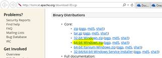

#Java Demo
Included below are step-by-step instructions for demonstrating Azure Eclipse Add-in and its integration with Azure Web Apps

##Pre-requisites
**Steps needed to setup the demo**

  1. Install Java SDK 8 from [here] (http://www.oracle.com/technetwork/java/javase/downloads/jdk8-downloads-2133151.html)
  2. Intall Eclipse IDE (Neon) from [here] (https://www.eclipse.org/downloads/)
  3. Install Tomcat from [here] (http://tomcat.apache.org/download-80.cgi) *(download and extract the zip file)*

  
