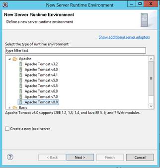

#Java Demo
Included below are step-by-step instructions for demonstrating Azure Eclipse Add-in and its integration with Azure Web Apps

##Pre-requisites
**Steps needed to setup the demo**

  1. Install Java SDK 8 from [here] (http://www.oracle.com/technetwork/java/javase/downloads/jdk8-downloads-2133151.html)
  2. Intall Eclipse IDE (Neon) from [here] (https://www.eclipse.org/downloads/)
  3. Install Tomcat from [here] (http://tomcat.apache.org/download-80.cgi) *(download and extract the zip file)*

  

##Setup Eclipse Plugin for Java
**Install the Azure toolkit for Eclipse**

  4. Launch Eclipse IDE. From the welcome screen, click **Help** and then click **Install New Software**
    

  5. In the next screen, in the Work with text box type **http://dl.microsoft.com/eclipse** and press **ENTER**. Select **Azure Toolkit for Java**, clear the check box for **Contact all update sites during install to find required software**, and then click **Next**. 
    

  6. In the Install Details dialog box review the components that will be installed and then click Next.
  7. In the Review Licenses dialog box, accept the terms of the license, and then click Finish.
  8. Once the installation is completed, you will be prompted to restart Eclipse. Click Yes from the dialog box to restart Eclipse.

*(**IMPORTANT** - HDInsight plugin for Eclipse will not install if Scala IDE for Eclipse is not installed. you can add the Scala IDE plugin by going to Help -> Install New SoftWare, and add http://download.scala-ide.org/sdk/lithium/e44/scala211/stable/site as source to download Scala Plugin for Eclipse.)*

##Log into Azure Subscription
  9. Open the Azure Explorer. From the Window menu in the IDE, click Show View and then click Other. From the dialog box that opens, expand Azure, click Azure Explorer, and then click OK.
    

  10. Right-click the Azure node in the Azure Explorer, and then click Manage Subscriptions.
  11. In the Manage Subscriptions dialog box, click Sign in and enter your Azure credentials.
    

  12. After you are logged in, the **Manage Subscriptions** dialog box lists all the Azure subscriptions associated with the credentials. Click **Close** in the dialog box.

##Create a Demo Web Project

  13. Create a new Dynamic Web Project in Eclipse
      

  14. Provide a name for the project and click finish
      ![Web Project Properties(media/image030.jpg)

  15. Within Eclipse’s Project Explorer view, expand AzureJavaProject. Right-click WebContent, click New, and then click JSP file. Name it *index.jsp*. Click Finish
      

  16. Add the below line within <body/> tags - <b><% out.println("Hello From Microsoft"); %></b>
      

  17. Notice the red X icon in the margin at the top of the index.jsp file.  If you hover over that, you’ll see an error: *The superclass "javax.servlet.http.HttpServlet" was not found on the Java Build Path* - Resolution explained below...
	

  18. Right-click on the ‘AzureJavaProject’ project and choose Properties.  
  19. Go to the Project Facets node, choose the Runtimes tab, and click New.
	

  20. Select 'Apache Tomcat v8.0' 
	

  21. On the Tomcat Server page, provide the path to the folder where you extracted Apache Tomcat to in the “Tomcat installation directory” textbox.  Click Finish.
	

  22. *Check* the server in the *runtimes* pane
	

 
#Create an Azure Deployment Project

  23. Right-click the web project and choose *package for Azure*
	

  24. Click 'New' from 'Deploy to Azure Web App Container' popup
	

  25. Fill-in details for the new Web App
	

  26. New Web App is Provisioned
	![Web App Provisioned] (media/image069.jpg)

  27. Publish the Web App. Click 'Published' link to view the Site.
	

  28. View the newly provisioned Web App in the [Azure Portal] (http://portal.azure.com)
	

  29 Highlight Java selection in Azure Web Apps Settings
	

 
##How to Debug Azure Web Apps in Eclipse

  30. In Eclipse, right click on a Web App project and select Debug As, then click on Azure Web App
	

  31. Accept the default values set by the Toolkit and click on Debug
	

  32. If a popup is displayed, click OK
	

  33. IDE will go ahead and enable remote debugging on Azure and launch a command prompt or shell that will prepare necessary remote connection for debugging. Then, insert a break point in a JSP or servlet in the Web App, open the Java Web App URL in a browser, and the IDE will now enter into debug mode. Start stepping through code and inspecting variables, as you have always been
	

*(**For More Details** - Read the documentation pages about remote debugging Java Web Apps on Azure in [Eclipse](https://azure.microsoft.com/en-us/documentation/articles/app-service-web-debug-java-web-app-in-eclipse/))*
